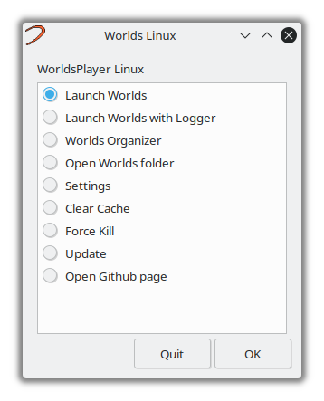
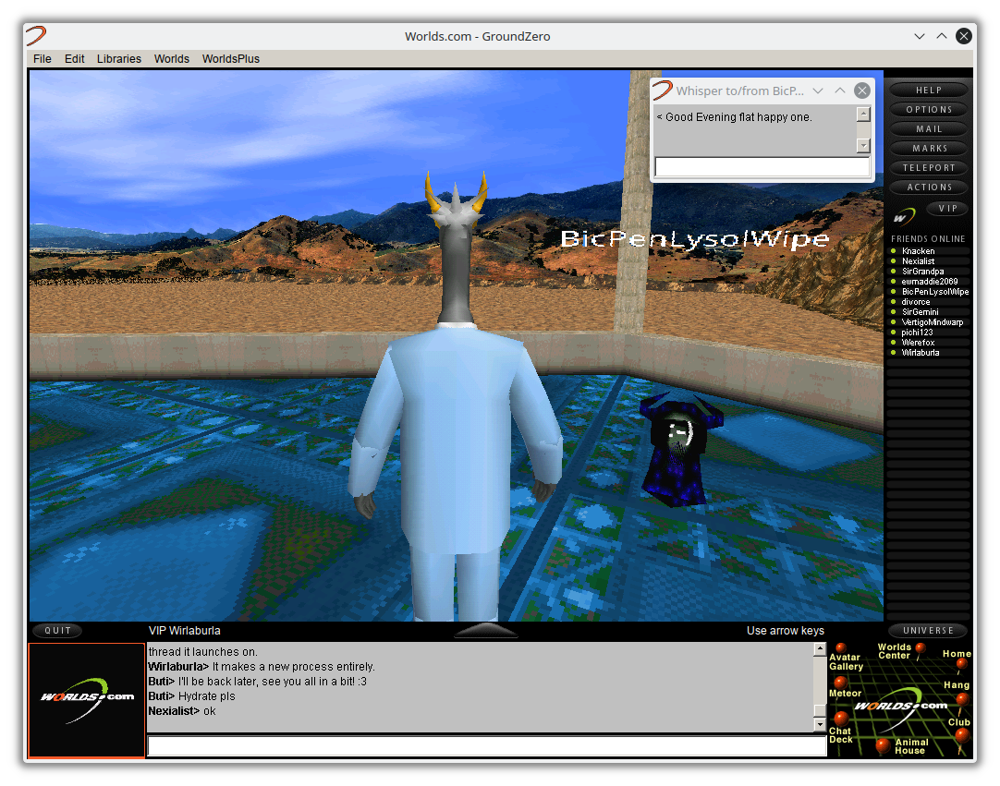

# Worlds-LinuxScript
Simple Linux wrapper for WorldsPlayer. Modded by MattTheTekie

## Installation
You don't need to clone this repository. Simply download `worlds-installer.sh` and execute it.

```
$ mkdir Worlds
$ wget https://github.com/MattTheTekie/MattTheTekie/raw/main/Personal-Scripts/WorldsOnlineLinux/worlds-installer.sh
$ chmod +x worlds-installer.sh
$ ./worlds-installer.sh
```

All worlds content should be in a folder named "Worlds" in the same location your install script resides. A launch script named `launch.sh` should be in it's root. This is the script that you should run. Now you can make a desktop entry pointing to that script and enjoy Worlds.





*WorldsPlayer and it's logo is property of Worlds Inc. and all rights belong to them.*
