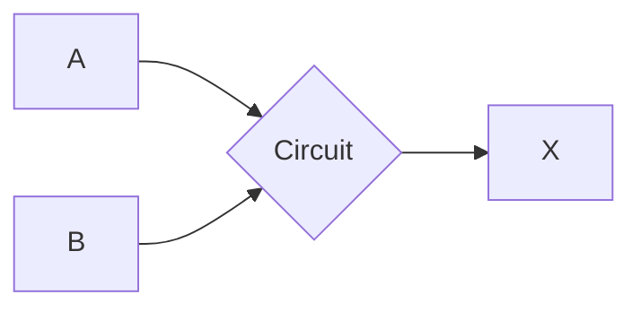

## Basic Operations of Boolean Algebra

### Logic Gates and Boolean Logic

The operations realized by a digital computer (binary), saw as complex, can be comprehended as **simple combinations of basic arithmetic and logical operations**.

- Sum of bits;
- Complement to bits;
- Move bits;
- Compare bits.

Those operations are implemented through electronic circuits, also known as **logic gates**.

there are only two conditions, 1 and 0, and logic circuits use predefined voltage ranges to represent these values.

**George Boole** developed his technique from symbols and represented the expressions by letters, making their connection through connectives (algebraic symbol).

Imagine that lower voltage is represented by bit 0 in it's range, passed it's range we reach high voltage, and high voltage is represented by bit 1, that way with bit 0 the equipment is off and with bit 1 the equipment is on.

That was the researcher Claude Shannon, from MIT, in 1938, who proposed that boolean algebra could be used to solve problems with projects of switching circuits. From the techniques of Shannon, it was possible to apply it in analyze and development of digital electronic circuits.

### Truth Table

It is a technique used to describe how the output of a logic circuit is dependent on the input logic levels, that is, they are tables that will contain **all possible combinations of the input variables of a given function and, as a result, the output values**.

Representation of a circuit with two entries and one output:

Now see the truth table of the circuit with two entries and one output:

| A | B | X
|---|---|---
| 0 | 0 | 1
| 0 | 1 | 0
| 1 | 0 | 1
| 1 | 1 | 0

### Basic Logical Functions

Those are the **basic logical functions**:

- **OR**;
- **AND**;
- **NOT**.

#### OR

When opening a car door, the light bulb in the vehicle's cabin should light up. Also when pressing the button without opening the car door. And, when closing the door, the lamp must be turned off.

It means it should light up if door is open **OR** the button is pressed.

The truth table for this situation:

| A | B | X = A + B
|---|---|----------
| 0 | 0 | 0
| 0 | 1 | 1
| 1 | 0 | 1
| 1 | 1 | 1

*Note: '+' sign here means **OR**.*

#### AND

On an elevator, the engine will be activated only if the door is closed. The elevator will move if the door is closed **AND** the button is pressed.

The truth table for this situation:

| A | B | $X = A \cdot B$
|---|---|----------
| 0 | 0 | 0
| 0 | 1 | 0
| 1 | 0 | 0
| 1 | 1 | 1

*Note: '$\cdot$' sign here means **AND**.*

#### NOT

Called **NOT** but also known as inverter. It is the only one that can operates with one single entry.

The gate's expression: $X = \overline A$.

The truth table for **NOT**:

| A | X = $\overline A$
|---|----------
| 0 | 1
| 1 | 0

#### Another Logic Gates

##### NOR

It is possible to make the output of an **OR** gate the entry of the **NOT** gate. The gate's expression: $X = \overline{A + B}$.

The truth table:

| A | B | A + B | $\overline{A + B}$
|---|---|-------|------
| 0 | 0 | 0 | 1
| 0 | 1 | 1 | 0
| 1 | 0 | 1 | 0
| 1 | 1 | 1 | 0

##### NAND

The gate's expression: $X = \overline{A \cdot B}$.

The gate's truth table:

| A | B | $A /cdot B$ | $X = \overline{A \cdot B}$
|---|---|-------|------
| 0 | 0 | 0 | 1
| 0 | 1 | 0 | 1
| 1 | 0 | 0 | 1
| 1 | 1 | 1 | 0

##### XOR

The **XOR** gate will be outputting 1 if at least one entry value is different from another. It's an particular case of the **OR** gate.

The gate's expression: $X = A \oplus B$.

The gate's truth table:

| A | B | $X = A \oplus B$
|---|---|------
| 0 | 0 | 0
| 0 | 1 | 1
| 1 | 0 | 1
| 1 | 1 | 0

##### XNOR

Only if two values are equal. The coincidence gate.

The gate's expression $X = A \odot B$.

The gate's truth table:

| A | B | $X = A \odot B$
|---|---|------
| 0 | 0 | 1
| 0 | 1 | 0
| 1 | 0 | 0
| 1 | 1 | 1

## Logical Gates and Operations

### Logical Expressions

Every logical circuit will execute an boolean expression. For example:

$X = A + \overline B \cdot C$

Truth table for the expression:

| A | B | C | $\overline B$ | $\overline B \cdot C$ | $X = A + \overline B \cdot C$
|---|---|---|---|---|------
| 0 | 0 | 0 | 1 | 0 | 0
| 0 | 0 | 1 | 1 | 1 | 1
| 0 | 1 | 0 | 0 | 0 | 0
| 0 | 1 | 1 | 0 | 0 | 0
| 1 | 0 | 0 | 1 | 0 | 1
| 1 | 0 | 1 | 1 | 1 | 1
| 1 | 1 | 0 | 0 | 0 | 1
| 1 | 1 | 1 | 0 | 1 | 1

### Equivalence of Logical Functions

Two logical functions are equivalent only if **for the same entry, they output same values**.

Example: $X = \overline{A \cdot A}$ is **equivalent** to $Y = \overline A$.

The truth table for the case:

| A | $A \cdot A$ | $Y = \overline A$ | $X = \overline{A \cdot A}$
|---|---|---|---
| 0 | 0 | 1 | 1
| 1 | 1 | 0 | 0

## Logical Expressions and Diagrams

### Rules of Boolean Algebra

| Rule | OR | AND
|------|----|-----
| 1. Identity | $X + 0 = X$ | $X \cdot 1 = X$
| 2. Null Element | $X + 1 = 1$ | $X \cdot 0 = 0$
| 3. Equivalence | $X + X = X$ | $X \cdot X = X$
| 4. Complement | $X + \overline X = 1$ | $X \cdot \overline X = 0$
| 5. Involution | $\overline X = X$ | $\overline X = X$
| 6. Commutative | $X + Y = Y + X$ | $X \cdot Y = X \cdot Y$
| 7. Associative | $(X + Y) + Z = X + (Y + Z)$ | $(X \cdot Y) \cdot Z = X \cdot (Y \cdot Z)$
| 8. Distributive | $X + Y \cdot Z = (X + Y) \cdot (X + Z)$ | $X \cdot (Y + Z) = X \cdot Y + X \cdot Z$
| 9. Absorption 1 | $X + X \cdot Y = X$ | $X \cdot (X + Y) = X$
| 10. Absorption 2 | $X + \overline X \cdot Y = X + Y$ | $X \cdot (\overline X + Y) = X \cdot Y$
| 11. Consensus | $X \cdot Y + \overline X \cdot Z + Y \cdot Z = X \cdot Y + \overline X \cdot Z$ | $(X + Y) \cdot (\overline X + Z) \cdot (Y + Z) = (X + Y) \cdot (\overline X + Z)$
| 12. De Morgan | $\overline{X + Y} = \overline X \cdot \overline Y$ | $\overline{X \cdot Y} = \overline X + \overline Y$

# Footer

- **Class**: Computer Architecture
- **Theme**: Digital Logic