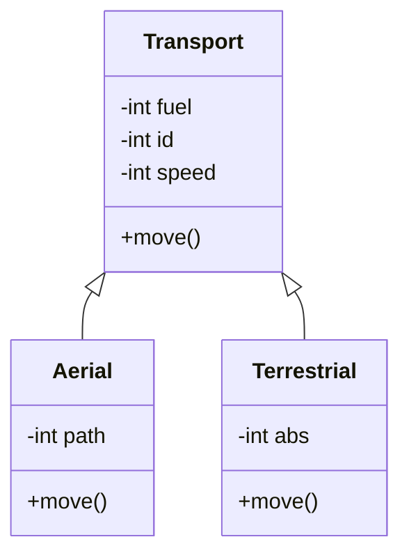

## Inherit

- Simple Inherit: When the class inherit attributes from one superclass;
- Multiple Inherit: When the class inherit attributes from various superclasses;

## Polymorphism

Polymorphism is one of the core concepts of object-oriented programming (OOP) and describes situations in which something occurs in several different forms. The same message will be executed in different ways, depending on the receiving object.

In computer science, it describes the concept that you can access objects of different types through the same interface.

Polymorphism happens when we reimplement a method in the subclasses of an inheritance:



As exemplified in the previous figure, the move() behavior in an object instantiated by the Aerial class will be different from the move() in an object of the Terrestrial class. An object will be able to send a message to move, while the receiving object will decide how this will be done.

## OOP Code in Python

Example of OOP code in Python:

```python
import datetime

class SavingAccount:
   def__init__(self, repaymentTax):
      self.repaymentTax = repaymentTax
      self.opening_date = datetime.datetime.today()

   def AccountRepayment(self)
      self.balance +=self.balance * self.repaymentTax

class ClientAccount:
  def__init__(self, number, IOF, IR, investmentValue, performanceTax):
    self.numero = number
    self.IOF = IOF
    self.IR = IR
    self.investmentValue = investmentValue
    self.investmentValue = performanceTax

  def PerformanceCalc(self):
    self.investmentValue += (self.investmentValue * self.performanceTax)
    self.investmentValue = (self.investmentValue – (self.performanceTax * self.IOF* self.IR)

  def Extract(Self): #(1)
    print(f"Extract of the account {self.number} is {self.investmentValue:10.2f}")

# NormalAccount
class NormalAccount(ClientAccount)
  def__init__(self, number, IOF, IR, investmentValue, performanceTax):
    super().__init__(numberIOFIR, investmentValue, performanceTax)

  def PerformanceCalc(self): #(2)
    sef.investmentValue += (self.investmentValue * self.performanceTax)

# MonetizedAccount
class MonetizedAccount(ClientAccount):
  def__init__(self, number, IOF, IR, investmentValue, performanceTax):
    super().__init__(numberIOFIR, investmentValue, performanceTax)

  def performanceCalc(self): #(3)
    sef.investmentValue += (self.investmentValue * self.performanceTax)
    sef.investmentValue -= self.investmentValue * self.IOF

# BankClass
class Bank():
  def__init__(self, code, name):
    self.code = code
    self.name = name
    self.accounts = []

  def AddAccount(self, clientAccount):
    self.accounts.append(clientAccount)

  def MonthlyPerformanceCalc(self): #(7)
    for c in self.accounts:
      c.PerformanceCalc()

  def PrintAccountsExtract(self):
    for c in self.accounts:
      c.Extract()

# Implementing
bank = Bank(999,"test")
clientAccount = ClientAccount(1,0.01,0.1,1000,0.05)
normalAccount = NormalAccount(2,0.01,0.1,2000,0.05)
monetizedAccount = MonetizedAccount(3,0.01,0.1,2000,0.05)

bank.AddAccount(clientAccount) #(4)
bank.AddAccount(normalAccount) #(5)
bank.AddAccount(monetizedAccount) #(6)
bank.MonthlyPerformanceCalc()#(7)
bank.PrintAccountsExtract() #(8)
```

## Exceptions

Like several object-oriented languages, Python allows the creation of types of exceptions to differentiate the errors generated by the language libraries from those generated by the developed applications. For this, you must use the inheritance feature to inherit new exceptions from Python's Exception class.

Example:

```python
class CustomizedException(exception):
  pass

  def throws(): (2)
    raise CustomizedException
    try:
      throws()
    except CustomizedException as ex:
      print ("Launched exception")
```

# Footer

- **Class**: Paradigms and Python Lang
- **Theme**: OOP With Python