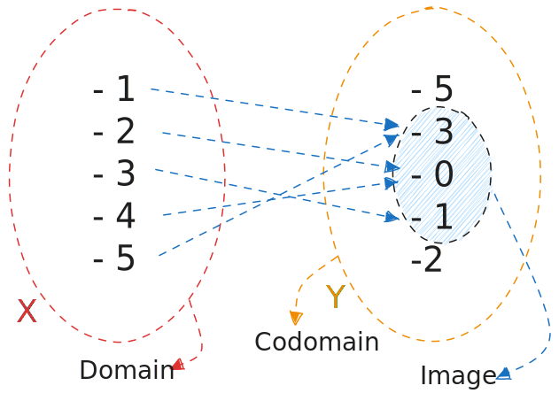

## Concept of Function (Domain, Images and Codomain)

A function is a relation between two sets, where every element of the first set is related to exactly one element of the second set.

- Notation: $D(f) = \{x \in \mathbb{R} | f(x) \in \mathbb{R} \}$

- Ex:

> *Notation: $f(x) = x^2 - 6x + 8$*

## Injective Function

A function is injective if every element of the codomain is mapped to by at most one element of the domain.

> In other terms: If you trace a horizontal line across the graph of an injective function, the line will only cross the graph in at most one place.

- Ex:

> *Notation: $f(x) = 2x + 1$*

## Surjective Function

A function is surjective if every element of the codomain is mapped to by at least one element of the domain.

- Ex:

> *Notation: $f(x) = x^2$*

## Bijective Function

A function is bijective if it is both injective and surjective.

- Ex:

> *Notation: $f(x) = x$*

## Inverse Function

> For a function to have an inverse, it must be bijective.

$Normal: f: X \rightarrow Y$

$Inverse: f^{-1}: Y \rightarrow X$

So:

$$
f(x) = y \iff f^{-1}(y) = x \\ Dom(f) = Im(f^{-1}) \\ Dom(f^{-1}) = Im(f) \\ x = f^{-1}(f(x)) \\ y = f(f^{-1}(y))
$$

## Increasing Function

A function is increasing if $x_1 < x_2 \implies f(x_1) < f(x_2)$

- Ex:

> *Notation: $f(x) = x$*

## Decreasing Function

A function is decreasing if $x_1 < x_2 \implies f(x_1) > f(x_2)$

## Periodic Function

A period is the interval of a periodic function after which the function repeats itself.

- Ex:

> Notation: Being $T$ the period of the function and $T > 0$, $f(x) = f(x + T)$

- *Note: Trigonometric functions are periodic.*

If $f$ is a periodic function with period $T$, then $f$ is also periodic with period $kT$, where $k \in \mathbb{N}$.

- In math terms:

$$
f(x) = f(x + T) = f(x + 2T) = ... = f(x + kT)
$$

## Graph of a Function

It can be defined as:

- Notation: $G(f) = \{(x, f(x)) | x \in D(f) \}$

Therefore, the ordinate $y$ of a point on the graph of the function $f$ is the value of $f$ on the corresponding abscissa $x$.
