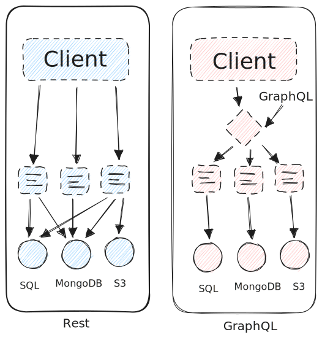

## Rest



Basically, with Rest API's model, you expose endpoints that serves the data for you.

Let's see an example:

> GET /users

```json
[
  {
    "id": 1,
    "name": "John Doe",
    "email": "johndoe@dubdubdodo.com"
  },
]
```

What if you want to get the user's posts?

> GET /users/1/posts

```json
[
  {
    "id": 1,
    "title": "GraphQL is awesome",
    "content": "Lorem ipsum dolor sit amet.",
    "author": {
      "id": 1,
      "name": "John Doe",
      "email": "johndoe@dubdubdodo.com",
    }
  },
]
```

That's Rest, let's see GraphQL:

## GraphQL

GraphQL server has two main parts: **Schema** and **Resolvers**.

Schema is where you define the types of your data, and the resolvers are the functions that will return the data.

Let's see an example:

```graphql
type User {
  id: ID!
  name: String!
  email: String!
  posts: [Post!]!
}

type Post {
  id: ID!
  title: String!
  content: String!
  author: User!
}

type Query {
  getUser(id: ID!): User!
  getPostsByTitle(title: String!): [Post!]!
}
```

This is the schema, it defines the types of data that we have, and the relations between them.

Now, let's see an example of a resolver:

```ts
const getUser (_, args) => {
  return sql.raw(`SELECT * FROM users WHERE id = ${args.id}`) // don't do this :0
}

const getPostsByTitle (_, args) => {
  return Post.find({ title: args.title })
}
```

In this example we show the flexibility of the resolvers: you can get different data from different sources, and return it.

## GraphQL Flow

For example, let's say you've made the following query (using the example in the last section):

```graphql
{
  getUser(id: 1) {
    name
    posts {
      title
      author {
        name // getting it twice here but doesn't matter
      }
    }
  }
}
```

The steps that GraphQL will take to resolve this query are:

1. Parse the query
2. Validate the query
3. Execute the query

### Parse the query

The server will receive the string and parse it to an [AST](https://en.wikipedia.org/wiki/Abstract_syntax_tree), and if it fails, the server will return a syntax error.

### Validate the query

Basically checks if the query matches the schema types.

### Execute the query

The server will execute the query, and will call the resolvers that are needed to resolve the query.

So for the example above, the server will call the `getUser` resolver, and then it will walk through the AST in order to get the data that is needed.

The execution flow in table form:

| Task | State | Step | Context |
| --- | --- | --- | --- |
| 3.1 | run | Query.getUser | |
| 3.2 | run | User.name and User.posts | for user returned in 3.1 |
| 3.3 | run | Post.title and Post.author | for each post returned in 3.2 |
| 3.4 | run | User.name | for each author returned in 3.3 |
